# Kafka MSK Test


## Kafka Overview
### Sizing the Kafka Cluster

When deciding the size and configuration of the Kafka cluster, it's important to be able to save the data for the retention period in the product that an engineering team needs. Sizing is not the same when the retention period is one day or one week. At same time you need to understand the nature of the data, the number of events per second the system receives, and the size of those events.

As example, we'll assume the system receives **10000** events per second and the payload average size is around **2.5KB**. With the payload average size and and the events per second we receive, we can calculate the ingestion throughput as 10,000 * 2500 = 24,400 KB/s, around 24MB/s of input throughput.

We want to keep a whole week of data in our Kafka cluster, that means we need to store at least **24,400KB * 60 seconds * 60 minutes * 24 hours * 7 days = 14757120000KB = 13.74TB.** So the topic size will be **13.74TB** at the end of a week and that'd be the needed disk size if we don't use replication at all.

For high availability production systems, the **recommended replication factor is at least 3**, that means our topic will use **3 * 13.74TB = 41.22TB.** Since the number of nodes should be higher than the replication factor we can use 4 nodes for now.

Assuming the replicas are equally distributed in the cluster, we'll need at least **41.22TB / 4 nodes = 10.3TB in each broker.** That'd be enough for the topic we've described, however in the system we may have more topics that will increase the needed disk size in each broker. In that case, we'd have 2 options:

1. Add more brokers with same disk size so the cluster can store more data
2. Increase disk size on each broker

The first option might be more expensive since you need to add more nodes to your cluster but at same time you'll improve its availability.


### Choosing Number of Partitions

The number of partitions of the topic will define the grade of parallelization for the topic, that means, the number of processes for the same consumer group that will consume messages from the topic. If the topic has N partitions, you can run up to N processes for the same consumer group, one process per partition.

A way to choose the number of partitions is understanding the performance of the producer and consumer. Most of the times the consumer will be slower than the producer, so you'll want to do some processing for every batch you consume from the topic. kafka-producer-perf-test.sh will allow you to measure the performance of the cluster when producing messages:

We need to create our topic:
```
./kafka-topics.sh --create --zookeeper <ZookeeperConnectString> --replication-factor <Replication Factor usually for good practices 3> --partitions <Number of partitions> --topic <topic name>
```

We send data to the producer:
```
./kafka-producer-perf-test.sh \
--topic <topic name> \
--num-records <total Records to send> \
--payload-file <path to your example payload file> \
--throughput <tps or msp to process> \
--producer-props acks=<0,1,2 depending on which configuration we want> bootstrap.servers=<Kafka Private End Point> \
--print-metrics
```

In order to measure your consumer performance you can prepare a testing environment with one topic having a single partition. That means you'd have a single process consuming from a single partition and you can know the real performance of our consumer. You can do different tests for different batch sizes, example:

| Batch Size | Consumer Throughput |
|------------|---------------------|
| 1000       | 2500 msgs/s         |
| 5000       | 2300 msgs/s         | 
| 2000       | 2650 msgs/s         |

As a **rule of thumb**, if we care about latency, it’s probably a good idea to limit the number of partitions per broker to **100 x b x r**, where **b is the number of brokers** in a Kafka cluster and **r is the replication factor.**

### Test in MSK provided cluster

The AWS msk tutorial can be followed to accomplish this, but we're going to change some settings: https://docs.aws.amazon.com/msk/latest/developerguide/create-cluster.html

#### Step 1: Create an Amazon MSK Cluster

1. Sign in to the AWS Management Console, and open the Amazon MSK console at https://console.aws.amazon.com/msk/home?region=us-east-1#/home/.

2. Choose Create cluster.

3. For Cluster name, we choose **kafka-test.**
4. Select Provisioned option
5. In **BrokerType** for test purposes we select **kafka.m5.2xlarge**

6. From the table under All cluster settings, copy the values of the following settings and save them because you need them later in this tutorial:

   * VPC 
   * Subnets 
   * Security groups associated with VPC 
7. Choose Create cluster.

#### Step 2: Create a Client Machine

In this step of Getting Started Using Amazon MSK, you create a client machine. You use this client machine to create a topic that produces and consumes data. For simplicity, we'll put this client machine in the same VPC as the MSK cluster. But a client machine doesn't have to be in the same VPC as the cluster.

**To create a client machine**

1. Open the Amazon EC2 console at https://console.aws.amazon.com/ec2/.

2. Choose Launch instances.

3. Choose Select to create an instance of Amazon Linux 2 AMI (HVM) - Kernel 5.10, SSD Volume Type.

4. Choose the t2.xlarge instance type by selecting the checkbox next to it.

5. Choose Next: Configure Instance Details.

6. In the Network list, choose the VPC whose ID you saved in Step 1: Create an Amazon MSK Cluster.

7. In the Auto-assign Public IP list, choose Enable.

8. In the menu near the top, choose Add Tags.

9. Choose Add Tag.

10. Enter Name for the Key and MSKKafkaTest for the Value.

11. Choose Review and Launch, and then choose Launch.

12. Choose Create a new key pair, enter MSKKafkaTest for Key pair name, and then choose Download Key Pair. Alternatively, you can use an existing key pair if you prefer.

13. Read the acknowledgement, select the checkbox next to it, and choose Launch Instances.

14. Choose View Instances. Then, in the Security Groups column, choose the security group that is associated with the MSKKafkaTest instance.

15. Copy the name of the security group, and save it for later.

16. Open the Amazon VPC console at https://console.aws.amazon.com/vpc/.

17. In the navigation pane, choose Security Groups. Find the security group whose ID you saved in Step 1: Create an Amazon MSK Cluster. Choose this row by selecting the checkbox in the first column.

18. In the Inbound Rules tab, choose Edit inbound rules.

19. Choose Add rule.

20. In the new rule, choose All traffic in the Type column. In the second field in the Source column, select the security group of the client machine. This is the group whose name you saved earlier in this step.

21. Choose Save rules. Now the cluster's security group can accept traffic that comes from the client machine's security group.

#### Step 3: Create a Topic

**To create a topic on the client machine**

1. Open the Amazon EC2 console at https://console.aws.amazon.com/ec2/.

2. In the navigation pane, choose Instances. Then select the checkbox beside the name of the client machine that you created in Step 2: Create a Client Machine.

3. Choose Actions, and then choose Connect. Follow the instructions in the console to connect to your client machine.

4. Install Java on the client machine by running the following command:

`sudo yum install java-1.8.0`

5. Run the following command to download Apache Kafka.

`wget https://archive.apache.org/dist/kafka/2.6.2/kafka_2.12-2.6.2.tgz`

**Note:**
If you want to use a mirror site other than the one used in this command, you can choose a different one on the Apache website.

6. Run the following command in the directory where you downloaded the TAR file in the previous step.

`tar -xzf kafka_2.12-2.6.2.tgz`

7. Go to the kafka_2.12-2.6.2 directory.

8. Open the Amazon MSK console at https://console.aws.amazon.com/msk/.

9. Wait for the status of kafka-test to become Active. This might take like 20 to 30 min. After the status becomes Active, choose the cluster name. This action takes you to a page where you can see the cluster summary.

10. Choose View client information.

11. Copy the private endpoint for plaintext authentication and the Apache ZooKeeper connection string (also for plaintext communication).

12. Run the following command, replacing **ZookeeperConnectString** with the string that you obtained in the previous instruction.

```
bin/kafka-topics.sh --create --zookeeper <<ZookeeperConnectString>> --replication-factor 3 --partitions 1 --topic kafka-test
```
In our case will be something like this:
```
./kafka-topics.sh \
--create \
--zookeeper z-2.kafkatest.hsqou3.c23.kafka.us-east-1.amazonaws.com:2181,z-1.kafkatest.hsqou3.c23.kafka.us-east-1.amazonaws.com:2181,z-3.kafkatest.hsqou3.c23.kafka.us-east-1.amazonaws.com:2181 \
--replication-factor 3 \
--partitions 1 \
--topic kafka-test
```

If the command succeeds, you see the following message: Created topic kafka-test.

#### Step 4: Produce and Consume Data

In this step of Getting Started Using Amazon MSK, we produce and consume data.

**To produce and consume messages**

1. Go to the **bin** folder of the Apache Kafka installation on the client machine, and create a text file named client.properties with the following contents.
```
security.protocol=PLAINTEXT
```
2. Create a file named **payload_test.json** with the contents of the dummy data
3. Run the following command in the bin folder, replacing **BootstrapBrokerString** with the private endpoint string.
```
./kafka-producer-perf-test.sh \
--topic kafka-test \
--num-records 1000000 \
--payload-file ./payload_test.json \
--throughput 25000 \
--producer-props acks=1 bootstrap.servers=<BootstrapBrokerString> \
--print-metrics
```
In our case it will look like this:
```
./kafka-producer-perf-test.sh \
--topic kafka-test \
--num-records 1000000 \
--payload-file ./payload_test.json \
--throughput 25000 \
--producer-props acks=1 bootstrap.servers=b-3.kafkatest.hsqou3.c23.kafka.us-east-1.amazonaws.com:9092,b-1.kafkatest.hsqou3.c23.kafka.us-east-1.amazonaws.com:9092,b-2.kafkatest.hsqou3.c23.kafka.us-east-1.amazonaws.com:9092 \
--print-metrics
```
3. Keep the connection to the client machine open, and then open a second, separate connection to that machine in a new window.
4. In the following command, replace **BootstrapBrokerStringTls** with the value that you saved earlier. Then, go to the bin folder and run the command using your second connection to the client machine.
```
./kafka-consumer-perf-test.sh \
   --broker-list <BootstrapBrokerStringTls> \
   --topic kafka-test \
   --fetch-size 1048576 \
   --messages 25000 \
   --threads 1 \
   --print-metrics
```
In our case it will look like this:
```
./kafka-consumer-perf-test.sh \
   --broker-list b-3.kafkatest.hsqou3.c23.kafka.us-east-1.amazonaws.com:9092,b-1.kafkatest.hsqou3.c23.kafka.us-east-1.amazonaws.com:9092,b-2.kafkatest.hsqou3.c23.kafka.us-east-1.amazonaws.com:9092 \
   --topic kafka-test \
   --fetch-size 1048576 \
   --messages 25000 \
   --threads 1 \
   --print-metrics
```

## Test Behaviour

We made tests to verify the **p99** latency in MSK with a provisioned cluster, sending **4MB** and an **example JSON 1.6 MB** dummy to the consumer:

* Specifying the Size of data:

| Batch Size | Partitions |
|------------|------------|
| 4 MB       | 1          |
| 4 MB       | 10         |
| 4 MB       | 100        |
| 4 MB       | 500        |
| 4 MB       | 1000       |

 * JSON example file:

| Batch Size | Partitions |
|------------|------------|
| 1.6 MB     | 1          |
| 1.6 MB     | 10         |
| 1.6 MB     | 100        |
| 1.6 MB     | 500        |
| 1.6 MB     | 1000       |

We used the **kafka-producer-perf-test.sh** and **kafka-consumer-perf-test.sh** for test purposes.

### Creating topics for the tests
**Note: run this inside the kafka version/bin folder**
First let’s create the topics for the test data.

The following example will result in different topics named: kafka_test_**n** :: where **n = number of partitions**

**Topic with 1 partition**
```
./kafka-topics.sh --create --zookeeper z-3.kafkatest.2sltvn.c23.kafka.us-east-1.amazonaws.com:2181,z-2.kafkatest.2sltvn.c23.kafka.us-east-1.amazonaws.com:2181,z-1.kafkatest.2sltvn.c23.kafka.us-east-1.amazonaws.com:2181 --replication-factor 3 --partitions 1 --topic kafka_test_1 --config max.message.bytes=20971520
```
**Topic with 10 partitions**
```
./kafka-topics.sh --create --zookeeper z-3.kafkatest.2sltvn.c23.kafka.us-east-1.amazonaws.com:2181,z-2.kafkatest.2sltvn.c23.kafka.us-east-1.amazonaws.com:2181,z-1.kafkatest.2sltvn.c23.kafka.us-east-1.amazonaws.com:2181 --replication-factor 3 --partitions 10 --topic kafka_test_10 --config max.message.bytes=20971520
```
**Topic with 100 partitions**
```
./kafka-topics.sh --create --zookeeper z-3.kafkatest.2sltvn.c23.kafka.us-east-1.amazonaws.com:2181,z-2.kafkatest.2sltvn.c23.kafka.us-east-1.amazonaws.com:2181,z-1.kafkatest.2sltvn.c23.kafka.us-east-1.amazonaws.com:2181 --replication-factor 3 --partitions 100 --topic kafka_test_100 --config max.message.bytes=20971520
```
**Topic with 500 partitions**
```
./kafka-topics.sh --create --zookeeper z-3.kafkatest.2sltvn.c23.kafka.us-east-1.amazonaws.com:2181,z-2.kafkatest.2sltvn.c23.kafka.us-east-1.amazonaws.com:2181,z-1.kafkatest.2sltvn.c23.kafka.us-east-1.amazonaws.com:2181 --replication-factor 3 --partitions 500 --topic kafka_test_500 --config max.message.bytes=20971520
```
**Topic with 1000 partitions**
```
./kafka-topics.sh --create --zookeeper z-3.kafkatest.2sltvn.c23.kafka.us-east-1.amazonaws.com:2181,z-2.kafkatest.2sltvn.c23.kafka.us-east-1.amazonaws.com:2181,z-1.kafkatest.2sltvn.c23.kafka.us-east-1.amazonaws.com:2181 --replication-factor 3 --partitions 1000 --topic kafka_test_1000 --config max.message.bytes=20971520
```
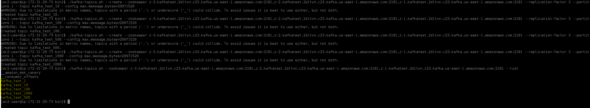


### Creating the producers sending 25000 tps and 1 Million total messages
**Note: run this inside the kafka version/bin folder**
Then run the producer performance test script with different configuration settings. The following example will use the topic created above to store 3 million messages with a size of 4 MB each.

We are going to produce 1 Million messages sending **25000/tps** testing the behaviour having different number of partitions per broker
to measure the **P99** latency


**Producer for 1 partition per broker**
```
./kafka-producer-perf-test.sh \
--topic kafka_test_1 \
--num-records 1000000 \
--record-size 4000 \
--throughput 25000 \
--producer-props acks=1 bootstrap.servers=b-2.kafkatest.2sltvn.c23.kafka.us-east-1.amazonaws.com:9092,b-3.kafkatest.2sltvn.c23.kafka.us-east-1.amazonaws.com:9092,b-1.kafkatest.2sltvn.c23.kafka.us-east-1.amazonaws.com:9092 \
--print-metrics
```
**The output, pretty much self-explanatory, will look similar to what we have next:**

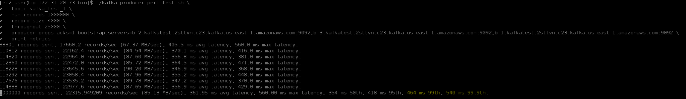

**Producer for 10 partitions per broker**
```
./kafka-producer-perf-test.sh \
--topic kafka_test_10 \
--num-records 1000000 \
--record-size 4000 \
--throughput 25000 \
--producer-props acks=1 bootstrap.servers=b-3.kafkatest.hsqou3.c23.kafka.us-east-1.amazonaws.com:9092,b-1.kafkatest.hsqou3.c23.kafka.us-east-1.amazonaws.com:9092,b-2.kafkatest.hsqou3.c23.kafka.us-east-1.amazonaws.com:9092 \
--print-metrics
```
**Output:**

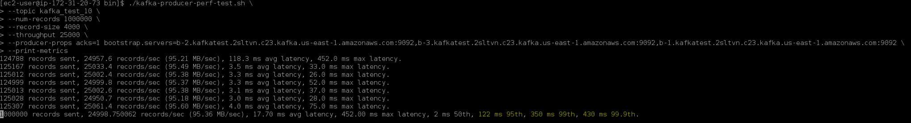

**Producer for 100 partitions per broker**
```
./kafka-producer-perf-test.sh \
--topic kafka_test_100 \
--num-records 1000000 \
--record-size 4000 \
--throughput 25000 \
--producer-props acks=1 bootstrap.servers=b-3.kafkatest.hsqou3.c23.kafka.us-east-1.amazonaws.com:9092,b-1.kafkatest.hsqou3.c23.kafka.us-east-1.amazonaws.com:9092,b-2.kafkatest.hsqou3.c23.kafka.us-east-1.amazonaws.com:9092 \
--print-metrics
```
**Output:**

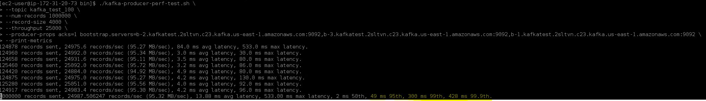

**Producer for 500 partitions per broker**
```
./kafka-producer-perf-test.sh \
--topic kafka_test_500 \
--num-records 1000000 \
--record-size 4000 \
--throughput 25000 \
--producer-props acks=1 bootstrap.servers=b-3.kafkatest.hsqou3.c23.kafka.us-east-1.amazonaws.com:9092,b-1.kafkatest.hsqou3.c23.kafka.us-east-1.amazonaws.com:9092,b-2.kafkatest.hsqou3.c23.kafka.us-east-1.amazonaws.com:9092 \
--print-metrics
```
**Output:**

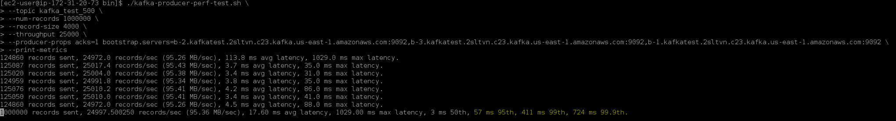

**Producer for 1000 partitions per broker**
```
./kafka-producer-perf-test.sh \
--topic kafka_test_1000 \
--num-records 1000000 \
--record-size 4000 \
--throughput 25000 \
--producer-props acks=1 bootstrap.servers=b-3.kafkatest.hsqou3.c23.kafka.us-east-1.amazonaws.com:9092,b-1.kafkatest.hsqou3.c23.kafka.us-east-1.amazonaws.com:9092,b-2.kafkatest.hsqou3.c23.kafka.us-east-1.amazonaws.com:9092 \
--print-metrics
```

**Output**

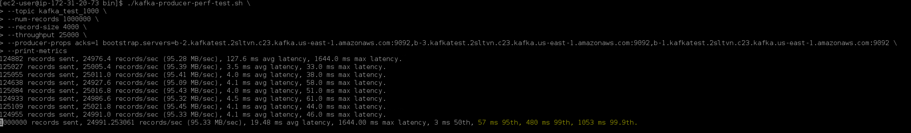

In this example, roughly 25k messages are produced per second on average, with a maximum latency of approx. 1.6 seconds.
The 95th percentile latency of 480 ms means that for 95% of messages (950 k. out of 1 mill.) it took less than 1 second between when they were produced and when they were written on all broker’s filesystem.
In the same way, the 1053 ms value for the 99.9th percentile means that 1 in 1000 messages experienced a delay of ~1.05 seconds from when it was produced until it was published and committed on broker’s segments.

### Test the Consumer Performance

To run the consumer performance test script as an example, will read 1 million messages from our same topic kafka_test_**n** :: **n=number of partitions**, via brokers. Additional parameters can be specified, see script’s help output for details.

**Consumer for 1 partition per broker**

```
./kafka-consumer-perf-test.sh \
--broker-list b-2.kafkatest.2sltvn.c23.kafka.us-east-1.amazonaws.com:9092,b-3.kafkatest.2sltvn.c23.kafka.us-east-1.amazonaws.com:9092,b-1.kafkatest.2sltvn.c23.kafka.us-east-1.amazonaws.com:9092 \
--topic kafka_test_1 \
--messages 25000
```

**Output**

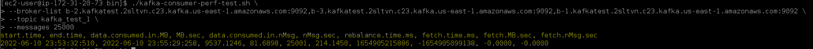

**Consumer for 10 partitions per broker**

```
./kafka-consumer-perf-test.sh \
--broker-list b-2.kafkatest.2sltvn.c23.kafka.us-east-1.amazonaws.com:9092,b-3.kafkatest.2sltvn.c23.kafka.us-east-1.amazonaws.com:9092,b-1.kafkatest.2sltvn.c23.kafka.us-east-1.amazonaws.com:9092 \
--topic kafka_test_10 \
--messages 25000
```

**Output**

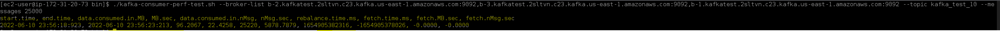

**Consumer for 100 partitions per broker**

```
./kafka-consumer-perf-test.sh \
--broker-list b-2.kafkatest.2sltvn.c23.kafka.us-east-1.amazonaws.com:9092,b-3.kafkatest.2sltvn.c23.kafka.us-east-1.amazonaws.com:9092,b-1.kafkatest.2sltvn.c23.kafka.us-east-1.amazonaws.com:9092 \
--topic kafka_test_100 \
--messages 25000
```

**Output**

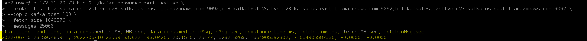

**Consumer for 500 partitions per broker**

```
./kafka-consumer-perf-test.sh \
--broker-list b-2.kafkatest.2sltvn.c23.kafka.us-east-1.amazonaws.com:9092,b-3.kafkatest.2sltvn.c23.kafka.us-east-1.amazonaws.com:9092,b-1.kafkatest.2sltvn.c23.kafka.us-east-1.amazonaws.com:9092 \
--topic kafka_test_500 \
--messages 25000
```

**Output**

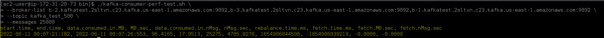

**Consumer for 1000 partitions per broker**

```
./kafka-consumer-perf-test.sh \
--broker-list b-2.kafkatest.2sltvn.c23.kafka.us-east-1.amazonaws.com:9092,b-3.kafkatest.2sltvn.c23.kafka.us-east-1.amazonaws.com:9092,b-1.kafkatest.2sltvn.c23.kafka.us-east-1.amazonaws.com:9092 \
--topic kafka_test_1000 \
--messages 25000
```

**Output**

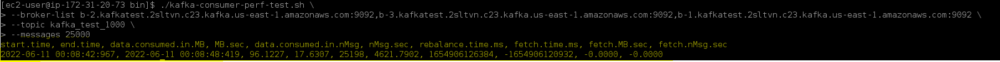

### Creating the producers sending 25000 tps and 1 Million total messages
**Note: run this inside the kafka version/bin folder**
Then run the producer performance test script with different configuration settings. The following example will use the topic created above to store 1 million messages and the size will depend on the JSON dummy file.

We are going to produce 1 Million messages sending **25000/tps** testing the behaviour having different number of partitions per broker
to measure the **P99** latency


**Producer for 1 partition per broker**
```
./kafka-producer-perf-test.sh \
--topic kafka_test_1 \
--num-records 1000000 \
--payload-file ./payload_test.json \
--throughput 25000 \
--producer-props acks=1 bootstrap.servers=b-2.kafkatest.2sltvn.c23.kafka.us-east-1.amazonaws.com:9092,b-3.kafkatest.2sltvn.c23.kafka.us-east-1.amazonaws.com:9092,b-1.kafkatest.2sltvn.c23.kafka.us-east-1.amazonaws.com:9092 \
--print-metrics
```
**The output, pretty much self-explanatory, will look similar to what we have next:**

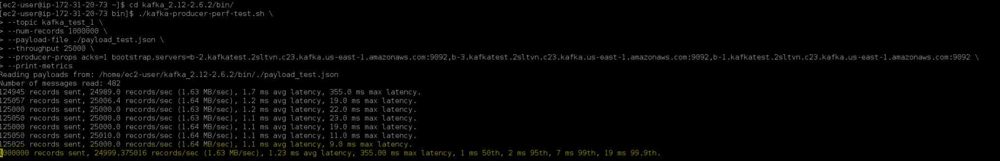

**Producer for 10 partitions per broker**
```
./kafka-producer-perf-test.sh \
--topic kafka_test_10 \
--num-records 1000000 \
--payload-file ./payload_test.json \
--throughput 25000 \
--producer-props acks=1 bootstrap.servers=b-2.kafkatest.2sltvn.c23.kafka.us-east-1.amazonaws.com:9092,b-3.kafkatest.2sltvn.c23.kafka.us-east-1.amazonaws.com:9092,b-1.kafkatest.2sltvn.c23.kafka.us-east-1.amazonaws.com:9092 \
--print-metrics
```
**Output:**

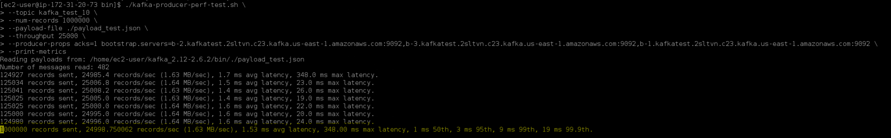

**Producer for 100 partitions per broker**
```
./kafka-producer-perf-test.sh \
--topic kafka_test_100 \
--num-records 1000000 \
--payload-file ./payload_test.json \
--throughput 25000 \
--producer-props acks=1 bootstrap.servers=b-2.kafkatest.2sltvn.c23.kafka.us-east-1.amazonaws.com:9092,b-3.kafkatest.2sltvn.c23.kafka.us-east-1.amazonaws.com:9092,b-1.kafkatest.2sltvn.c23.kafka.us-east-1.amazonaws.com:9092 \
--print-metrics
```
**Output:**

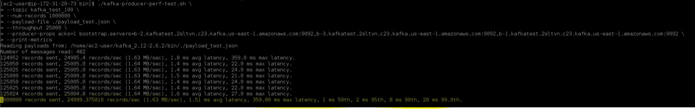

**Producer for 500 partitions per broker**
```
./kafka-producer-perf-test.sh \
--topic kafka_test_500 \
--num-records 1000000 \
--payload-file ./payload_test.json \
--throughput 25000 \
--producer-props acks=1 bootstrap.servers=b-2.kafkatest.2sltvn.c23.kafka.us-east-1.amazonaws.com:9092,b-3.kafkatest.2sltvn.c23.kafka.us-east-1.amazonaws.com:9092,b-1.kafkatest.2sltvn.c23.kafka.us-east-1.amazonaws.com:9092 \
--print-metrics
```
**Output:**

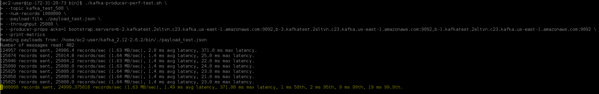

**Producer for 1000 partitions per broker**
```
./kafka-producer-perf-test.sh \
--topic kafka_test_1000 \
--num-records 1000000 \
--payload-file ./payload_test.json \
--throughput 25000 \
--producer-props acks=1 bootstrap.servers=b-2.kafkatest.2sltvn.c23.kafka.us-east-1.amazonaws.com:9092,b-3.kafkatest.2sltvn.c23.kafka.us-east-1.amazonaws.com:9092,b-1.kafkatest.2sltvn.c23.kafka.us-east-1.amazonaws.com:9092 \
--print-metrics
```

**Output**

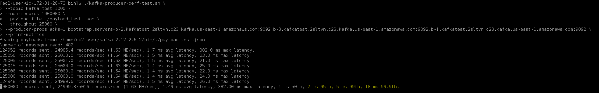

In this example, roughly 25k messages are produced per second on average, with a maximum latency of approx of .4 seconds.
The 95th percentile latency of 5 ms means that for 95% of messages (950K. out of 1 mill.) it took less than one second between when they were produced and when they were written on all broker’s filesystem.
In the same way, the 18 ms value for the 99.9th percentile means that 1 in 1000 messages experienced a delay of less than one second from when it was produced until it was published and committed on broker’s segments.

### Test the Consumer Performance

To run the consumer performance test script as an example, will read 3 million messages from our same topic ssl-perf-test, via brokers SSL port 9093 with the configs from our earlier ssl-perf-test.properties file. Additional parameters can be specified, see script’s help output for details.
For better output readability, use jq to transpose the rows and columns:

**Consumer for 1 partition per broker**

```
./kafka-consumer-perf-test.sh \
--broker-list b-2.kafkatest.2sltvn.c23.kafka.us-east-1.amazonaws.com:9092,b-3.kafkatest.2sltvn.c23.kafka.us-east-1.amazonaws.com:9092,b-1.kafkatest.2sltvn.c23.kafka.us-east-1.amazonaws.com:9092 \
--topic kafka_test_1 \
--messages 25000
```

**Output**

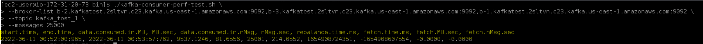

**Consumer for 10 partitions per broker**

```
./kafka-consumer-perf-test.sh \
--broker-list b-2.kafkatest.2sltvn.c23.kafka.us-east-1.amazonaws.com:9092,b-3.kafkatest.2sltvn.c23.kafka.us-east-1.amazonaws.com:9092,b-1.kafkatest.2sltvn.c23.kafka.us-east-1.amazonaws.com:9092 \
--topic kafka_test_10 \
--messages 25000
```

**Output**

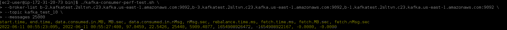

**Consumer for 100 partitions per broker**

```
./kafka-consumer-perf-test.sh \
--broker-list b-2.kafkatest.2sltvn.c23.kafka.us-east-1.amazonaws.com:9092,b-3.kafkatest.2sltvn.c23.kafka.us-east-1.amazonaws.com:9092,b-1.kafkatest.2sltvn.c23.kafka.us-east-1.amazonaws.com:9092 \
--topic kafka_test_100 \
--messages 25000
```

**Output**

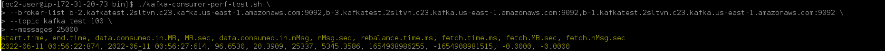

**Consumer for 500 partitions per broker**

```
./kafka-consumer-perf-test.sh \
--broker-list b-2.kafkatest.2sltvn.c23.kafka.us-east-1.amazonaws.com:9092,b-3.kafkatest.2sltvn.c23.kafka.us-east-1.amazonaws.com:9092,b-1.kafkatest.2sltvn.c23.kafka.us-east-1.amazonaws.com:9092 \
--topic kafka_test_500 \
--messages 25000
```

**Output**

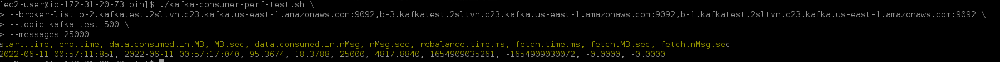

**Consumer for 1000 partitions per broker**

```
./kafka-consumer-perf-test.sh \
--broker-list b-2.kafkatest.2sltvn.c23.kafka.us-east-1.amazonaws.com:9092,b-3.kafkatest.2sltvn.c23.kafka.us-east-1.amazonaws.com:9092,b-1.kafkatest.2sltvn.c23.kafka.us-east-1.amazonaws.com:9092 \
--topic kafka_test_1000 \
--messages 25000
```

**Output**

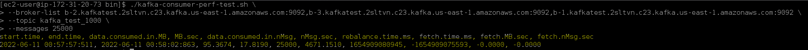

### Test the End-To-End Latency

**Note: run this inside the kafka version/bin folder**

**End-to-end latency is the time between when a message is produced and when it is consumed. This is especially important for real-time applications.**

If we look at the content of kafka-consumer-perf-test.sh script for example, will see a call for kafka-run-class.sh script, with kafka.tools.ConsumerPerformance class as argument. So in the same way we can try running:

`./kafka-run-class.sh kafka.tools.EndToEndLatency --help`

which will show:
```
USAGE: java kafka.tools.EndToEndLatency$ broker_list topic num_messages producer_acks message_size_bytes [optional] properties_file
```

So for example, to produce and consume 12k messages of 4 KiB each in our kafka_test_1 topic, with acks value set to 1 (leader acks), we will have:
```
./kafka-run-class.sh kafka.tools.EndToEndLatency \
b-2.kafkatest.2sltvn.c23.kafka.us-east-1.amazonaws.com:9092,b-3.kafkatest.2sltvn.c23.kafka.us-east-1.amazonaws.com:9092,b-1.kafkatest.2sltvn.c23.kafka.us-east-1.amazonaws.com:9092 \
kafka_test_1 12000 1 4000
```

which will produce an output similar to the following:

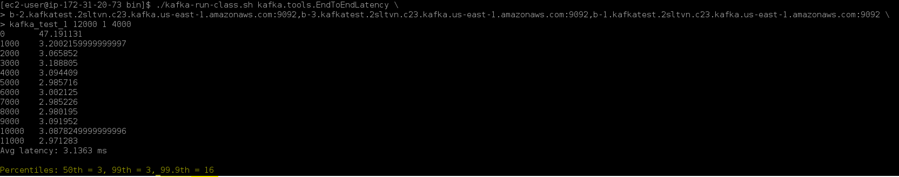

Produce and consume 12k messages of 4 KiB each in our kafka_test_10 topic, with acks value set to 1 (leader acks), we will have:
```
./kafka-run-class.sh kafka.tools.EndToEndLatency \
b-2.kafkatest.2sltvn.c23.kafka.us-east-1.amazonaws.com:9092,b-3.kafkatest.2sltvn.c23.kafka.us-east-1.amazonaws.com:9092,b-1.kafkatest.2sltvn.c23.kafka.us-east-1.amazonaws.com:9092 \
kafka_test_10 12000 1 4000
```

**Output**

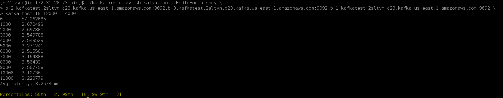

Produce and consume 12k messages of 4 KiB each in our kafka_test_100 topic, with acks value set to 1 (leader acks), we will have:
```
./kafka-run-class.sh kafka.tools.EndToEndLatency \
b-2.kafkatest.2sltvn.c23.kafka.us-east-1.amazonaws.com:9092,b-3.kafkatest.2sltvn.c23.kafka.us-east-1.amazonaws.com:9092,b-1.kafkatest.2sltvn.c23.kafka.us-east-1.amazonaws.com:9092 \
kafka_test_100 12000 1 4000
```

**Output**

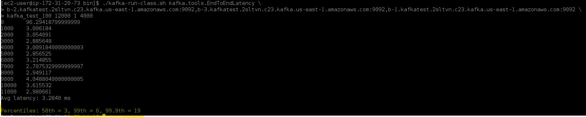

Produce and consume 12k messages of 4 KiB each in our kafka_test_500 topic, with acks value set to 1 (leader acks), we will have:
```
./kafka-run-class.sh kafka.tools.EndToEndLatency \
b-2.kafkatest.2sltvn.c23.kafka.us-east-1.amazonaws.com:9092,b-3.kafkatest.2sltvn.c23.kafka.us-east-1.amazonaws.com:9092,b-1.kafkatest.2sltvn.c23.kafka.us-east-1.amazonaws.com:9092 \
kafka_test_500 12000 1 4000
```

**Output**

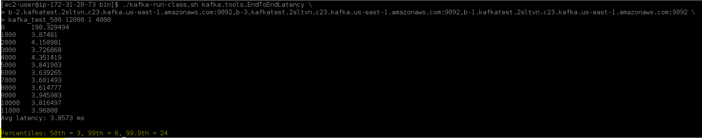

Produce and consume 12k messages of 4 KiB each in our kafka_test_1000 topic, with acks value set to 1 (leader acks), we will have:
```
./kafka-run-class.sh kafka.tools.EndToEndLatency \
b-2.kafkatest.2sltvn.c23.kafka.us-east-1.amazonaws.com:9092,b-3.kafkatest.2sltvn.c23.kafka.us-east-1.amazonaws.com:9092,b-1.kafkatest.2sltvn.c23.kafka.us-east-1.amazonaws.com:9092 \
kafka_test_1000 12000 1 4000
```

**Output**

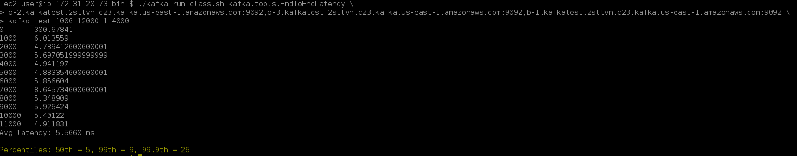

### Final Results Summary

| Partitions | Latency 99th 4MB | Latency 99.9th 4MB | Latency 99th JSON Dummy File | Latency 99.9th JSON Dummy File | E2E Latency |
|------------|------------------|--------------------|------------------------------|--------------------------------|-------------|
| 1          | 464 ms           | 540 ms             | 7 ms                         | 19 ms                          | 3.1363 ms   |
| 10         | 350 ms           | 430 ms             | 9 ms                         | 19 ms                          | 3.2574 ms   |
| 100        | 300 ms           | 428 ms             | 8 ms                         | 20 ms                          | 3.2840 ms   |
| 500        | 411 ms           | 724 ms             | 9 ms                         | 19 ms                          | 3.8573 ms   |
| 1000       | 480 ms           | 1053 ms            | 5 ms                         | 18 ms                          | 5.5060 ms   |

### Step 5: Delete the AWS Resources Created for The Test

**To delete the resources using the AWS Management Console**

1. Open the Amazon MSK console at https://console.aws.amazon.com/msk/.

2. Choose kafka-test.

3. Choose Actions, then choose Delete.

4. Open the Amazon EC2 console at https://console.aws.amazon.com/ec2/.

5. Choose MSKKafkaTest.

6. Choose Instance state, then choose Terminate instance.