# Kafka MSK Test


## Kafka Overview
### Sizing the Kafka Cluster

When deciding the size and configuration of the Kafka cluster, it's important to be able to save the data for the retention period in the product that an engineering team needs. Sizing is not the same when the retention period is one day or one week. At same time you need to understand the nature of the data, the number of events per second the system receives, and the size of those events.

As example, we'll assume the system receives **10000** events per second and the payload average size is around **2.5KB**. With the payload average size and and the events per second we receive, we can calculate the ingestion throughput as 10,000 * 2500 = 24,400 KB/s, around 24MB/s of input throughput.

We want to keep a whole week of data in our Kafka cluster, that means we need to store at least **24,400KB * 60 seconds * 60 minutes * 24 hours * 7 days = 14757120000KB = 13.74TB.** So the topic size will be **13.74TB** at the end of a week and that'd be the needed disk size if we don't use replication at all.

For high availability production systems, the **recommended replication factor is at least 3**, that means our topic will use **3 * 13.74TB = 41.22TB.** Since the number of nodes should be higher than the replication factor we can use 4 nodes for now.

Assuming the replicas are equally distributed in the cluster, we'll need at least **41.22TB / 4 nodes = 10.3TB in each broker.** That'd be enough for the topic we've described, however in the system we may have more topics that will increase the needed disk size in each broker. In that case, we'd have 2 options:

1. Add more brokers with same disk size so the cluster can store more data
2. Increase disk size on each broker

The first option might be more expensive since you need to add more nodes to your cluster but at same time you'll improve its availability.


### Choosing Number of Partitions

The number of partitions of the topic will define the grade of parallelization for the topic, that means, the number of processes for the same consumer group that will consume messages from the topic. If the topic has N partitions, you can run up to N processes for the same consumer group, one process per partition.

A way to choose the number of partitions is understanding the performance of the producer and consumer. Most of the times the consumer will be slower than the producer, so you'll want to do some processing for every batch you consume from the topic. kafka-producer-perf-test.sh will allow you to measure the performance of the cluster when producing messages:

We need to create our topic:
```
./kafka-topics.sh --create --zookeeper <ZookeeperConnectString> --replication-factor <Replication Factor usually for good practices 3> --partitions <Number of partitions> --topic <topic name>
```

We send data to the producer:
```
./kafka-producer-perf-test.sh \
--topic <topic name> \
--num-records <total Records to send> \
--payload-file <path to your example payload file> \
--throughput <tps or msp to process> \
--producer-props acks=<0,1,2 depending on which configuration we want> bootstrap.servers=<Kafka Private End Point> \
--print-metrics
```

In order to measure your consumer performance you can prepare a testing environment with one topic having a single partition. That means you'd have a single process consuming from a single partition and you can know the real performance of our consumer. You can do different tests for different batch sizes, example:

| Batch Size | Consumer Throughput |
|------------|---------------------|
| 1000       | 2500 msgs/s         |
| 5000       | 2300 msgs/s         | 
| 2000       | 2650 msgs/s         |

As a **rule of thumb**, if we care about latency, it’s probably a good idea to limit the number of partitions per broker to **100 x b x r**, where **b is the number of brokers** in a Kafka cluster and **r is the replication factor.**

### Test in MSK Serverless cluster

The AWS msk tutorial can be followed to accomplish this, but we're going to change some settings: https://docs.aws.amazon.com/msk/latest/developerguide/create-cluster.html

#### Step 1: Create an Amazon MSK Cluster

1. Sign in to the AWS Management Console, and open the Amazon MSK console at https://docs.aws.amazon.com/msk/latest/developerguide/create-serverless-cluster.html

2. Choose Create cluster.

3. For Creation method, leave the Quick create option selected. The Quick create option lets you create a serverless cluster with default settings.

4. For Cluster name, we choose **msk-serverless-tutorial.**

5. For General cluster properties, choose Serverless as the Cluster type. Use the default values for the remaining General cluster properties.

6. Note the table under All cluster settings. This table lists the default values for important settings such as networking and availability, and indicates whether you can change each setting after you create the cluster. To change a setting before you create the cluster, you should choose the Custom create option under Creation method.

7. Choose Create cluster.

**To gather information about the cluster**

1. In the Cluster summary section, choose View client information. This button remains grayed out until Amazon MSK finishes creating the cluster. You might need to wait a few minutes until the button becomes active so you can use it.

2. Copy the string under the label Endpoint. This is your bootstrap-server string.

3. Choose the Properties tab.

4. Under the Networking settings section, copy the IDs of the subnets and the security group and save them because you need this information later to create a client machine.

5. Choose any of the subnets. This opens the Amazon VPC Console. Find the ID of the Amazon VPC that is associated with the subnet. Save this Amazon VPC ID for later use.

#### Step 2: Create an IAM role

In this step, we need to perform two tasks. 

The first task is to create an IAM policy that grants access to create topics on the cluster and to send data to those topics. The second task is to create an IAM role and associate this policy with it. In a later step, we create a client machine that assumes this role and uses it to create a topic on the cluster and to send data to that topic.

**To create an IAM policy that makes it possible to create topics and write to them**

1. Open the IAM console at https://console.aws.amazon.com/iam/.

2. On the navigation pane, choose Policies.

3. Choose Create Policy.

4. Choose the JSON tab, then replace the JSON in the editor window with the following JSON. 

5. Replace region with the code of the AWS Region where you created your cluster, and Account-ID with your account ID.

```
{
    "Version": "2012-10-17",
    "Statement": [
        {
            "Effect": "Allow",
            "Action": [
                "kafka-cluster:Connect",
                "kafka-cluster:AlterCluster",
                "kafka-cluster:DescribeCluster"
            ],
            "Resource": [
                "arn:aws:kafka:region:Account-ID:cluster/msk-serverless-tutorial/*"
            ]
        },
        {
            "Effect": "Allow",
            "Action": [
                "kafka-cluster:*Topic*",
                "kafka-cluster:WriteData",
                "kafka-cluster:ReadData"
            ],
            "Resource": [
                "arn:aws:kafka:region:Account-ID:topic/msk-serverless-tutorial/*"
            ]
        },
        {
            "Effect": "Allow",
            "Action": [
                "kafka-cluster:AlterGroup",
                "kafka-cluster:DescribeGroup"
            ],
            "Resource": [
                "arn:aws:kafka:region:Account-ID:group/msk-serverless-tutorial/*"
            ]
        }
    ]
}
```
5. Choose Next: Tags.

6. Choose Next: Review.

7. For the policy name, enter msk-serverless-tutorial.

8. Choose Create policy.

**To create an IAM role and attach the policy to it**

1. On the navigation pane, choose Roles.

2. Choose Create role.

3. Under Common use cases, choose EC2, then choose Next: Permissions.

4. In the search box, enter msk-serverless-tutorial, then select the box to the left of the policy.

5. Choose Next: Tags.

6. Choose Next: Review.

7. For the role name, enter msk-serverless-tutorial.

8. Choose Create role.

#### Step 2: Create a client machine

In the step, we need to perform two tasks. 

The first task is to create an Amazon EC2 instance to use as an Apache Kafka client machine. The second task is to install Java and Apache Kafka tools on the machine.

**To create a client machine**

1. Open the Amazon EC2 console at https://console.aws.amazon.com/ec2/.

2. Choose Launch instances.

3. Choose the first Select button.

4. Choose Next: **Configure Instance Details.**

5. For Network, choose the serverless cluster's virtual private cloud (VPC). This is the VPC based on the Amazon VPC service whose ID you saved after you created the cluster.

6. For Subnet, choose the subnet whose ID you saved after you created the cluster.

7. For **IAM role**, choose msk-serverless-tutorial.

8. Choose Next: Add Storage

9. Choose Next: Add Tags.

10. Choose Add Tag, then under Key enter Name and under Value enter msk-serverless-tutorial.

11. Choose **Next: Configure Security Group.**

12. Choose the button labeled **Select an existing security group.**

13. In the list of security groups, select the security group associated with the cluster. This works if that security group has an inbound rule that allows traffic from the security group to itself. Such a rule allows members of the same security group to communicate with each other. For more information, see Security group rules in the Amazon VPC Developer Guide.

14. Choose **Review and Launch** and then choose **Launch**.

15. Choose an existing key pair, or create a new key pair.

16. Choose **Launch Instances**, and then choose **View Instances.**

17. Choose the check box in the row that represents this newly created Amazon EC2 instance. From this point forward, we call this instance the client machine.

18. Choose **Connect** and follow the instructions to connect to the client machine.

**To set up Apache Kafka client tools on the client machine**

1. To install Java, run the following command on the client machine:

`sudo yum -y install java-11`

2. To get the Apache Kafka tools that we need to create topics and send data, run the following commands:

`wget https://archive.apache.org/dist/kafka/2.8.1/kafka_2.12-2.8.1.tgz`

`tar -xzf kafka_2.12-2.8.1.tgz`

3. Go to the kafka_2.12-2.8.1/libs directory, then run the following command to download the Amazon MSK IAM JAR file. The Amazon MSK IAM JAR makes it possible for the client machine to access the cluster.
```
wget https://github.com/aws/aws-msk-iam-auth/releases/download/v1.1.1/aws-msk-iam-auth-1.1.1-all.jar
```

4. Go to the kafka_2.12-2.8.1/bin directory. Copy the following property settings and paste them into a new file. Name the file client.properties and save it.
```
security.protocol=SASL_SSL
sasl.mechanism=AWS_MSK_IAM
sasl.jaas.config=software.amazon.msk.auth.iam.IAMLoginModule required;
sasl.client.callback.handler.class=software.amazon.msk.auth.iam.IAMClientCallbackHandler
```

#### Step 4: Create a topic

In this step, you use the previously created client machine to create a topic on the serverless cluster.

**To create a topic and write data to it**

1. In the following export command, replace my-endpoint with the bootstrap-server string you that you saved after you created the cluster. Then, go to the kafka_2.12-2.8.1/bin directory on the client machine, and run the export command.

```
export BS=my-endpoint
```

2. Run the following command to create a topic named msk-serverless-tutorial on your serverless cluster. Replace my-endpoint with the bootstrap-server string you that you saved after you created the cluster.

```
./kafka-topics.sh --bootstrap-server my-endpoint --command-config client.properties --create --topic msk-serverless-tutorial --partitions 6
```

It will look like this:
```
./kafka-topics.sh --bootstrap-server boot-q1rtfju2.c3.kafka-serverless.us-east-1.amazonaws.com:9098 --command-config client.properties --create --topic msk-serverless-tutorial --partitions 6
```

#### Step 5: Produce and Consume Data

In this step of Getting Started Using Amazon MSK, we produce and consume data.

**To produce and consume messages**

1. Create a file named **payload_test.json** with the contents of the dummy data.

2. Run the following command in the bin folder. Replace my-endpoint with the bootstrap-server string you that you saved after you created the cluster.
```
./kafka-producer-perf-test.sh \ 
--producer.config client.properties \ 
--topic test_topic \ 
--num-records 1000000 \ 
--payload-file ./payload_test.json \ 
--throughput 25000 \ 
--producer-props acks=1 bootstrap.servers=my-endpoint \ 
--print-metrics
```

It will look like this:
```
./kafka-producer-perf-test.sh \ 
--producer.config client.properties \ 
--topic test_topic \ 
--num-records 1000000 \ 
--payload-file ./payload_test.json \ 
--throughput 25000 \ 
--producer-props acks=1 bootstrap.servers=boot-q1rtfju2.c3.kafka-serverless.us-east-1.amazonaws.com:9098 \ 
--print-metrics
```

3. Keep the connection to the client machine open, and then open a second, separate connection to that machine in a new window.
4. 
5. In the following command, replace **my-endpoint** with the value that you saved earlier. Then, go to the bin folder and run the command using your second connection to the client machine.
```
./kafka-consumer-perf-test.sh \ 
--consumer.config client.properties \ 
--bootstrap-server bootstrap.servers=my-endpoint \ 
--topic test_topic \ 
--fetch-size 1048576 \ 
--messages 25000 \ 
--print-metrics
```
In our case it will look like this:
```
./kafka-consumer-perf-test.sh \ 
--consumer.config client.properties \ 
--bootstrap-server bootstrap.servers=boot-q1rtfju2.c3.kafka-serverless.us-east-1.amazonaws.com:9098 \ 
--topic test_topic \ 
--fetch-size 1048576 \ 
--messages 25000 \ 
--print-metrics
```

## Test Behaviour

We made tests to verify the **p99** latency in MSK with a Serverless cluster, sending **4MB** and an **example JSON 1.6 MB** dummy to the consumer:

* Specifying the Size of data:

| Batch Size | Partitions |
|------------|------------|
| 4 MB       | 6          |
| 4 MB       | 10         |
| 4 MB       | 100        |

* JSON example file:

| Batch Size | Partitions |
|------------|------------|
| 1.6 MB     | 6          |
| 1.6 MB     | 10         |
| 1.6 MB     | 100        |

We used the **kafka-producer-perf-test.sh** and **kafka-consumer-perf-test.sh** for test purposes.

### Creating topics for the tests
**Note: run this inside the kafka version/bin folder**
First let’s create the topics for the test data.

The following example will result in different topics named: kafka_test_**n** :: where **n = number of partitions**

**Topic with 6 partitions**
```
./kafka-topics.sh --bootstrap-server boot-w1dcqcvm.c3.kafka-serverless.us-east-1.amazonaws.com:9098  --command-config client.properties --create --topic kafka_test_6  --partitions 6
```
**Topic with 10 partitions**
```
./kafka-topics.sh --bootstrap-server boot-w1dcqcvm.c3.kafka-serverless.us-east-1.amazonaws.com:9098  --command-config client.properties --create --topic kafka_test_10  --partitions 10
```
**Topic with 100 partitions**
```
./kafka-topics.sh --bootstrap-server boot-w1dcqcvm.c3.kafka-serverless.us-east-1.amazonaws.com:9098  --command-config client.properties --create --topic kafka_test_100  --partitions 100
```

### Creating the producers sending 25000 tps and 1 Million total messages
**Note: run this inside the kafka version/bin folder**
Then run the producer performance test script with different configuration settings. The following example will use the topic created above to store 3 million messages with a size of 4 MB each.

We are going to produce 1 Million messages sending **25000/tps** testing the behaviour having different number of partitions per broker
to measure the **P99** latency

**Producer for 6 partitions per broker**
```
./kafka-producer-perf-test.sh \
--producer.config client.properties \
--topic kafka_test_6 \
--num-records 1000000 \
--record-size 4000 \
--throughput 25000 \
--producer-props acks=1 bootstrap.servers=boot-w1dcqcvm.c3.kafka-serverless.us-east-1.amazonaws.com:9098 \
--print-metrics
```
**The output, pretty much self-explanatory, will look similar to what we have next:**

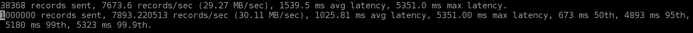

**Producer for 10 partitions per broker**
```
./kafka-producer-perf-test.sh \
--producer.config client.properties \
--topic kafka_test_10 \
--num-records 1000000 \
--record-size 4000 \
--throughput 25000 \
--producer-props acks=1 bootstrap.servers=boot-w1dcqcvm.c3.kafka-serverless.us-east-1.amazonaws.com:9098 \
--print-metrics
```
**Output:**


**Producer for 100 partitions per broker**
```
./kafka-producer-perf-test.sh \
--producer.config client.properties \
--topic kafka_test_100 \
--num-records 1000000 \
--record-size 4000 \
--throughput 25000 \
--producer-props acks=1 bootstrap.servers=boot-w1dcqcvm.c3.kafka-serverless.us-east-1.amazonaws.com:9098 \
--print-metrics
```
**Output:**


**Producer for 10 partitions per broker 10M tps**
```
./kafka-producer-perf-test.sh \
--producer.config client.properties \
--topic kafka_test_10 \
--num-records 10000000 \
--record-size 4000 \
--throughput 25000 \
--producer-props acks=1 bootstrap.servers=boot-w1dcqcvm.c3.kafka-serverless.us-east-1.amazonaws.com:9098 \
--print-metrics
```
**Output:**

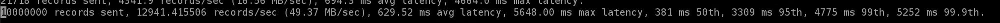

**Producer for 100 partitions per broker 10M tps**
```
./kafka-producer-perf-test.sh \
--producer.config client.properties \
--topic kafka_test_100 \
--num-records 10000000 \
--record-size 4000 \
--throughput 25000 \
--producer-props acks=1 bootstrap.servers=boot-w1dcqcvm.c3.kafka-serverless.us-east-1.amazonaws.com:9098 \
--print-metrics
```
**Output:**


In this example, roughly 25k messages are produced per second on average, with a maximum latency of approx. 1.3 seconds.
The 95th percentile latency of 294 ms means that for 95% of messages (9.5 mill k. out of 10 mill.) it took less than 1 second between when they were produced and when they were written on all broker’s filesystem.
In the same way, the 858 ms value for the 99.9th percentile means that 1 in 10000 messages experienced a delay of ~0.85 seconds from when it was produced until it was published and committed on broker’s segments.

### Test the Consumer Performance

To run the consumer performance test script as an example, will read 1 million messages from our same topic kafka_test_**n** :: **n=number of partitions**, via brokers. Additional parameters can be specified, see script’s help output for details.

**Consumer for 6 partitions per broker**
```
./kafka-consumer-perf-test.sh \
--consumer.config client.properties \
--bootstrap-server boot-w1dcqcvm.c3.kafka-serverless.us-east-1.amazonaws.com:9098 \
--topic kafka_test_6 \
--messages 25000 \
--print-metrics
```
**Output**

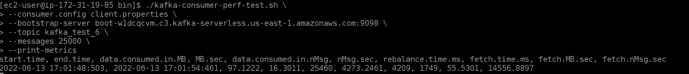

**Consumer for 10 partitions per broker**

```
./kafka-consumer-perf-test.sh \
--consumer.config client.properties \
--bootstrap-server boot-w1dcqcvm.c3.kafka-serverless.us-east-1.amazonaws.com:9098 \
--topic kafka_test_10 \
--messages 25000 \
--print-metrics
```
**Output**
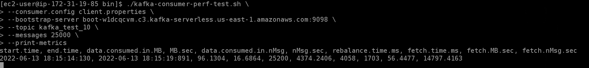


**Consumer for 100 partitions per broker**

```
./kafka-consumer-perf-test.sh \
--consumer.config client.properties \
--bootstrap-server boot-w1dcqcvm.c3.kafka-serverless.us-east-1.amazonaws.com:9098 \
--topic kafka_test_100 \
--messages 25000 \
--print-metrics
```

**Output**

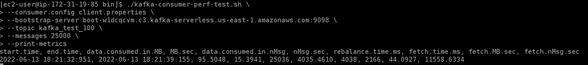


### Creating the producers sending 25000 tps and 1 Million total messages
**Note: run this inside the kafka version/bin folder**
Then run the producer performance test script with different configuration settings. The following example will use the topic created above to store 1 million messages and the size will depend on the JSON dummy file.

We are going to produce 1 Million messages sending **25000/tps** testing the behaviour having different number of partitions per broker
to measure the **P99** latency

**Producer for 6 partitions per broker**
```
./kafka-producer-perf-test.sh \ 
--producer.config client.properties \ 
--topic kafka_test_6 \ 
--num-records 1000000 \ 
--payload-file ./payload_test.json \ 
--throughput 25000 \ 
--producer-props acks=1 bootstrap.servers=boot-w1dcqcvm.c3.kafka-serverless.us-east-1.amazonaws.com:9098 \ 
--print-metrics
```
**The output, pretty much self-explanatory, will look similar to what we have next:**

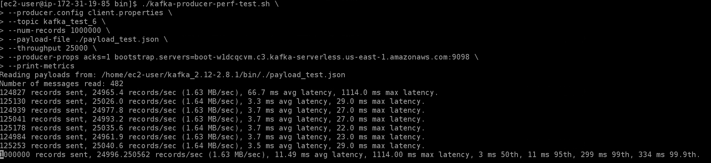

**Producer for 10 partitions per broker**
```
./kafka-producer-perf-test.sh \
--producer.config client.properties \
--topic kafka_test_10 \
--num-records 1000000 \
--payload-file ./payload_test.json \
--throughput 25000 \
--producer-props acks=1 bootstrap.servers=boot-w1dcqcvm.c3.kafka-serverless.us-east-1.amazonaws.com:9098 \
--print-metrics
```
**Output:**

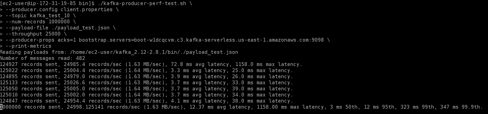

**Producer for 100 partitions per broker**
```
./kafka-producer-perf-test.sh \
--producer.config client.properties \
--topic kafka_test_100 \
--num-records 1000000 \
--payload-file ./payload_test.json \
--throughput 25000 \
--producer-props acks=1 bootstrap.servers=boot-w1dcqcvm.c3.kafka-serverless.us-east-1.amazonaws.com:9098 \
--print-metrics
```
**Output:**

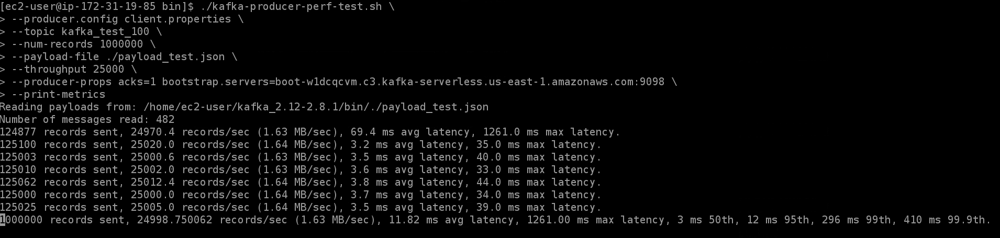

**Producer for 10 partitions per broker 10M**
```
./kafka-producer-perf-test.sh \
--producer.config client.properties \
--topic kafka_test_10 \
--num-records 10000000 \
--payload-file ./payload_test.json \
--throughput 25000 \
--producer-props acks=1 bootstrap.servers=boot-w1dcqcvm.c3.kafka-serverless.us-east-1.amazonaws.com:9098 \
--print-metrics
```
**Output:**


**Producer for 100 partitions per broker 10 M**
```
./kafka-producer-perf-test.sh \
--producer.config client.properties \
--topic kafka_test_100 \
--num-records 10000000 \
--payload-file ./payload_test.json \
--throughput 25000 \
--producer-props acks=1 bootstrap.servers=boot-w1dcqcvm.c3.kafka-serverless.us-east-1.amazonaws.com:9098 \
--print-metrics
```
**Output:**


In this example, roughly 25k messages are produced per second on average, with a maximum latency of approx of 1.2 seconds.
The 95th percentile latency of 9 ms means that for 95% of messages (9.5 mill. out of 10 mill.) it took less than one second between when they were produced and when they were written on all broker’s filesystem.
In the same way, the 321 ms value for the 99.9th percentile means that 1 in 1000 messages experienced a delay of less than one second from when it was produced until it was published and committed on broker’s segments.

### Test the Consumer Performance

To run the consumer performance test script as an example, will read 3 million messages from our same topic ssl-perf-test, via brokers SSL port 9093 with the configs from our earlier ssl-perf-test.properties file. Additional parameters can be specified, see script’s help output for details.
For better output readability, use jq to transpose the rows and columns:

**Consumer for 6 partitions per broker**

```
./kafka-consumer-perf-test.sh \
--consumer.config client.properties \
--bootstrap-server boot-w1dcqcvm.c3.kafka-serverless.us-east-1.amazonaws.com:9098 \
--topic kafka_test_6 \
--messages 25000 \
--print-metrics
```

**Output**

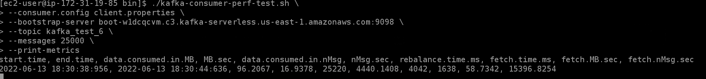

**Consumer for 10 partitions per broker**

```
./kafka-consumer-perf-test.sh \
--consumer.config client.properties \
--bootstrap-server boot-w1dcqcvm.c3.kafka-serverless.us-east-1.amazonaws.com:9098 \
--topic kafka_test_100 \
--messages 25000 \
--print-metrics
```

**Output**

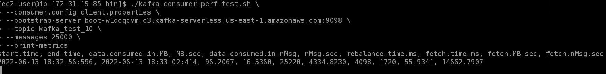

**Consumer for 100 partitions per broker**

```
./kafka-consumer-perf-test.sh \
--consumer.config client.properties \
--bootstrap-server boot-w1dcqcvm.c3.kafka-serverless.us-east-1.amazonaws.com:9098 \
--topic kafka_test_100 \
--messages 25000 \
--print-metrics
```

**Output**

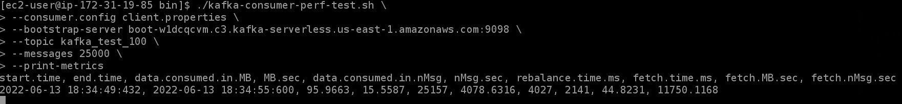

### Final Results Summary

| Partitions | Latency 99th 4MB | Latency 99.9th 4MB | Latency 99th JSON Dummy File | Latency 99.9th JSON Dummy File | 
|------------|------------------|--------------------|------------------------------|--------------------------------|
| 6          | 5180 ms          | 5323 ms            | 299 ms                       | 334 ms                         | 
| 10         | 4774 ms          | 4993 ms            | 323 ms                       | 347 ms                         | 
| 100        | 865 ms           | 1206 ms            | 296 ms                       | 410 ms                         |

**10 Million test**

| Partitions | Latency 99th 4MB | Latency 99.9th 4MB | Latency 99th JSON Dummy File | Latency 99.9th JSON Dummy File | 
|------------|------------------|--------------------|------------------------------|--------------------------------|
| 10         | 4775 ms          | 5252 ms            | 14 ms                        | 294 ms                         | 
| 100        | 294  ms          | 858  ms            | 17 ms                        | 321 ms                         |

### Step 5: Delete the AWS Resources Created for The Test

**To delete the resources using the AWS Management Console**

1. Open the Amazon MSK console at https://console.aws.amazon.com/msk/.

2. Choose kafka-test.

3. Choose Actions, then choose Delete.

4. Open the Amazon EC2 console at https://console.aws.amazon.com/ec2/.

5. Choose MSKKafkaTest.

6. Choose Instance state, then choose Terminate instance.